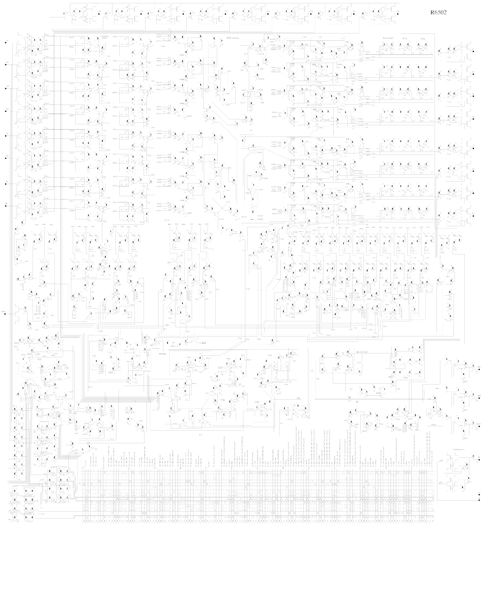
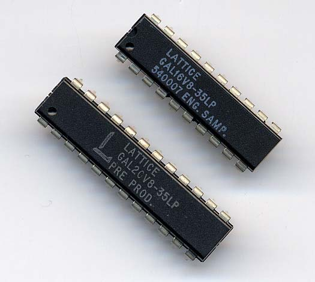

---
title:
- FPGA Workshop
author:
- Jack Leightcap; `{nuieeeofficers,wirelessclub}@gmail.com`
theme:
- Copenhagen
date:
- Spring 2021 -- November 15, 2021
---

# Background: Workshop Structure
- what is an FPGA
- how to make them do things
- do some things with FPGA

general notes:

- ask questions at any time!
- reach out with any lingering questions

# Background: FPGA History


#


# Background: FPGA History


# Background: Modern FPGA


# Background: Modern FPGA

## QUESITON
why use an FPGA over a microcontroller?

# Background: Verilog

- a HDL (hardware description language)
	- others HDLs exist
	- familiar C syntax
	- fundamentally different underlying abstraction
- replaced gate-level and transistor-level design

# Verilog: Combinational Logic

## AND Gate
```Verilog
module and;

wire x, y, z;
assign z = x & y;

endmodule

```

# Verilog: Combinational Logic

## Nested Logic
```verilog
module complex(
	input a14, a15, a12, a13,
	output srce
);

wire and_result, or_result;
assign and_result = a14 & a15;
assign or_result = a12 | a13;
assign srce = and_result & or_result;

endmodule;
```

# Verilog: Sequential Logic

## Latch
```verilog
module register(
	input clk, we, oe, in,
	output out
);
reg memory;
always @(posedge clk) begin
	if (we) memory <= in;
end

assign out = we ? memory : 1'b0;

endmodule
```

# Verilog: Testbench

[https://www.jdoodle.com/execute-verilog-online/](https://www.jdoodle.com/execute-verilog-online/)

##
```verilog
initial begin
    #0 clk=0; enable_i=0; data_i=0; enable_o=0;
	#1 clk=1;
    forever #1 clk=!clk;
end
initial begin
	$monitor("clk=%d we=%d oe=%d in=%d out=%d",
	          clk,   we,   oe,   in,   out);
	#1 we=1; in=1;
	#1 oe=1;
	#1 in=0;
	#1 $finish;
end
```

# Verilog: Testbench Results

```
			clk=0 we=0 oe=0 in=0 out=0
			clk=1 we=1 oe=0 in=1 out=0
			clk=0 we=1 oe=1 in=1 out=1
			clk=1 we=1 oe=1 in=0 out=0
			clk=0 we=1 oe=1 in=0 out=0
```

# Verilog: Testbench Results


# FPGA: Routing

## DigitalJS
[http://digitaljs.tilk.eu/#](http://digitaljs.tilk.eu/#)

#


# FPGAs: Not Covered

general

- languages
	- VHDL, SystemVerilog
	- Chisel (Scala), Hardcaml (OCaml), Clash (Haskell)
- formal verification
- timing analysis

use cases

- CPU design
- signal processing
- ML/AI
- accelerators
